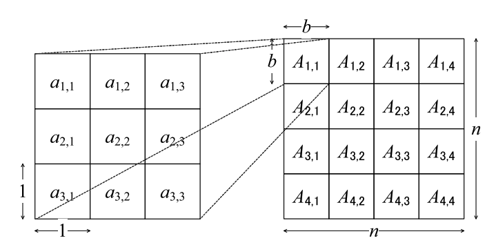
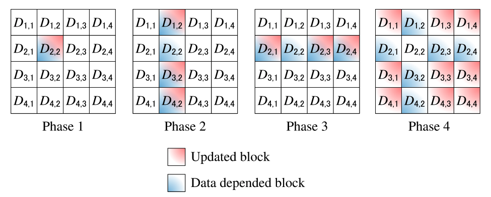

# <center>**Parallel all-pairs shortest paths via Floyd-Warshall**</center>

<p align='right'>Bing Xue (bx2109@nyu.edu)</p>

> Repo link: https://github.com/XueBingo/HPC

## Introduction

The Floyd-Warshall algorithm is a widely used algorithm for finding the shortest paths between all pairs of vertices in a graph. However, its computational complexity can become a bottleneck for large graphs. To address this issue, the blocked Floyd-Warshall algorithm was proposed, which partitions the graph into smaller blocks and performs computations on these blocks in parallel. In this project, we aimed to optimize the performance of the blocked Floyd-Warshall algorithm by investigating two key factors: block size and thread number. By conducting experiments and analyzing the results, we sought to identify the optimal configurations that would lead to improved speedup and execution time.


## Related Work

**Floyd-Warshall Algorithm**

Floyd–Warshall algorithm (also known as Floyd's algorithm) is an algorithm for finding shortest paths in a directed weighted graph with no negative cycles.

```
let dist be a |V| × |V| array of minimum distances initialized to ∞ (infinity)
for each edge (u, v) do
    dist[u][v] ← w(u, v)  // The weight of the edge (u, v)
for each vertex v do
    dist[v][v] ← 0
for k from 1 to |V|
    for i from 1 to |V|
        for j from 1 to |V|
            if dist[i][j] > dist[i][k] + dist[k][j] 
                dist[i][j] ← dist[i][k] + dist[k][j]
            end if
```

**Complexity**

Time: $O(N^3)$

Space: $O(N^2)$

**Idea of Dynamic Programming**
\- *shortestPath(i, j, k)* the length of the shortest possible path from *i* to *j* using vertices only from the set *{1, 2, …, k}* as intermediate points along the way.
$$
shortestPath(i, j, k) = min(shortestPath(i, j, k-1), \\shortestPath(i, k, k-1) + shortestPath(k, j, k-1))
$$


## Blocked Floyd-Warshall Algorithm

**Blocked Algorithm**

The Blocked Floyd-Warshall algorithm divides the graph into smaller subgraphs, called blocks. The algorithm then runs the Floyd-Warshall algorithm on each block separately. After the algorithm finishes processing all the blocks, it combines the results to obtain the shortest paths between all pairs of vertices in the entire graph.

The idea behind the Blocked Floyd-Warshall algorithm is that by dividing the graph into blocks, the algorithm can take advantage of the locality of reference. That is, when computing the shortest paths between vertices, the algorithm only needs to consider the edges that belong to the same block. This reduces the amount of data that needs to be accessed from memory, which can significantly improve the performance of the algorithm.



To implement the Blocked Floyd-Warshall algorithm, we first divide the graph into blocks. The size of the blocks can be chosen based on the size of the graph and the available memory. Once the graph is divided into blocks, we run the Floyd-Warshall algorithm on each block separately. The results of each block are then combined to obtain the shortest paths between all pairs of vertices in the entire graph.

The Blocked Floyd-Warshall algorithm is a powerful technique that can significantly improve the performance of the Floyd-Warshall algorithm on large graphs. However, the choice of block size is critical to the performance of the algorithm. If the block size is too small, the algorithm may spend too much time copying data between blocks. On the other hand, if the block size is too large, the algorithm may not take advantage of the locality of reference, which can reduce its performance.



**Flops rate and Bandwidth**

Vanilla Floyd’s algorithm:

- Flops: 2 * N^3
- Bandwidth: 3 * N^3 * sizeof(double)

Blocked Floyd’s algorithm:

- Flops: 2 * num_blocks^3 * b^3 = 2 * N^3
- Bandwidth: 3 * b^3 * (1 + 2*(num_blocks-1) + 2*(num_blocks-1)*num_blocks) * num_block * sizeof(double)


## Experiment Design & Result Analysis

> All experiments are conducted on cruchy5

### Block Size Test

Implement the blocked Floyd-Warshall algorithm and test with different block sizes.

> thread_num = 6; number of nodes: 1024; extent of density: 0.4

| Blocksize | Speedup  | runtime   |
| --------- | -------- | --------- |
| 2         | 2.57771  | 1047.53ms |
| 4         | 1.97248  | 1306.49ms |
| 8         | 3.42254  | 820.603ms |
| 16        | 2.57254  | 953.349ms |
| 32        | 3.21533  | 806.372ms |
| 64        | 3.60334  | 683.659ms |
| 128       | 2.72105  | 897.027ms |
| 256       | 2.21836  | 1188.57ms |
| 512       | 0.912799 | 2938.49ms |

**Analysis**: 

- Smaller block sizes (2 and 4) achieved higher speedup values compared to larger block sizes. This indicates that for the given graph and thread configuration, smaller block sizes led to better parallelization and improved performance.
- The block size of 64 achieved the highest speedup of 3.60334, indicating that it provided the best trade-off between computation and memory overhead for this particular graph and thread configuration.
- Block sizes larger than 64 (128, 256, and 512) resulted in decreased speedup values. This might be due to increased memory access latency and contention between threads accessing shared memory.
- Overall, the block size test highlights the importance of selecting an appropriate block size to achieve optimal performance in the blocked Floyd-Warshall algorithm. Experimentation and analysis of specific graph and hardware configurations are crucial to determine the most suitable block size for a given scenario.

### Graph Size & Thread Number Test

To measure the speedup achieved by parallelizing the blocked Floyd-Warshall algorithm with different thread numbers on graphs of varying sizes.

> block_size = 64; extent of density: 0.4

| Thread_num | Speedup(1024) | Speedup(2048) | Speedup(4096) |
| ---------- | ------------- | ------------- | ------------- |
| 1          | 0.941806      | 0.792646      | 0.746197      |
| 2          | 1.6021        | 1.63377       | 1.33122       |
| 4          | 3.13167       | 3.03736       | 2.62579       |
| 6          | 3.72682       | 4.16382       | 4.11298       |
| 8          | 5.60064       | 5.98784       | 5.22908       |
| 12         | 5.81209       | 7.775         | 6.98217       |
| 16         | 8.65687       | 12.1603       | 10.9226       |
| 32         | 7.79624       | 13.3655       | 18.9583       |
| 64         | 5.90143       | 13.4108       | 5.79327       |


**Analysis**: 

- The initial speedup improvement with increasing thread numbers can be attributed to better parallelization and workload distribution.
- The decreasing speedup at higher thread numbers might be due to increased overhead from thread synchronization, contention for shared resources, or limitations in the hardware architecture.
- The optimal thread number for achieving the highest speedup varies depending on the graph size and the characteristics of the hardware platform.
- It's weird that the speedup acquired by the blocked Floyd’s algorithm with 64 threads is very slow compared with past experiments.


## Future Work

We can do more experiments on the sparsity of the graph. Denser graphs are expected to acquire more speedup under the same settings.

From the algorithm design and experiments analysis, it can be seen that Amdahl’s law limits the speedup since we can not parallelize Floyd’s algorithm within the blocks, especially when the block size grows, which may result in another problem that a big block cannot fit in the cache. In addition, the dependence between the k-th problem and the previous ones also somehow forces us on how to do the computation. 

There are several ways to improve the performance of the blocked Floyd-Warshall algorithm beyond the basic implementation discussed earlier. Here are some ideas:

1. Multilevel blocking: By dividing the graph into smaller blocks at each level, the algorithm can take advantage of the locality of reference and reduce memory access overhead.
2. Parallelization on multiple levels: The blocked Floyd-Warshall algorithm can be parallelized on multiple levels to further improve performance. For example, it can be parallelized across multiple CPUs or GPUs, or it can be parallelized using SIMD instructions on each CPU or GPU core. Additionally, the algorithm can be parallelized using both shared and distributed memory techniques to take advantage of the full computational power of a cluster or supercomputer.
3. Hybrid approaches: Hybrid approaches that combine the blocked Floyd-Warshall algorithm with other algorithms or data structures can also be used to improve performance. For example, the blocked Floyd-Warshall algorithm can be combined with graph partitioning techniques to reduce the size of each block and improve load balance, or it can be combined with parallel priority queue data structures to accelerate the computation of shortest paths within each block.


## Conclusion

In this project, we optimized the blocked Floyd-Warshall algorithm by investigating the impact of block size and thread number on its performance. We found that smaller block sizes generally resulted in higher speedup values, indicating better parallelization. Among the tested block sizes, a block size of 64 emerged as optimal. The speedup increased with the number of threads but eventually reached a point of diminishing returns. The optimal thread number varied depending on the graph size. By carefully selecting block size and thread number, we can effectively leverage parallelization and reduce the execution time for computing shortest paths in large graphs. Further optimizations and considerations for different hardware architectures can enhance the algorithm's performance.


## Reference & Acknowledgement

1. https://www.jstage.jst.go.jp/article/transinf/E95.D/12/E95.D_2759/_pdf
2. [https://en.wikipedia.org/wiki/Floyd%E2%80%93Warshall_algorithm](https://en.wikipedia.org/wiki/Floyd–Warshall_algorithm)
3. https://www.geeksforgeeks.org/floyd-warshall-algorithm-dp-16/
4. [https://en.wikipedia.org/wiki/Dijkstra%27s_algorithm](https://en.wikipedia.org/wiki/Dijkstra's_algorithm)
5. https://www.cs.usfca.edu/~galles/visualization/Floyd.html
